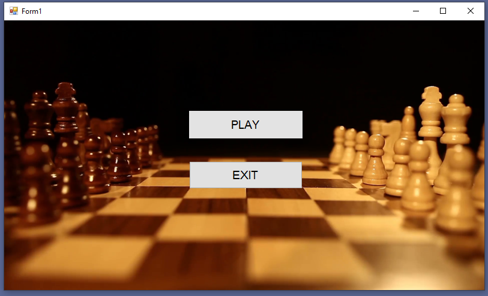
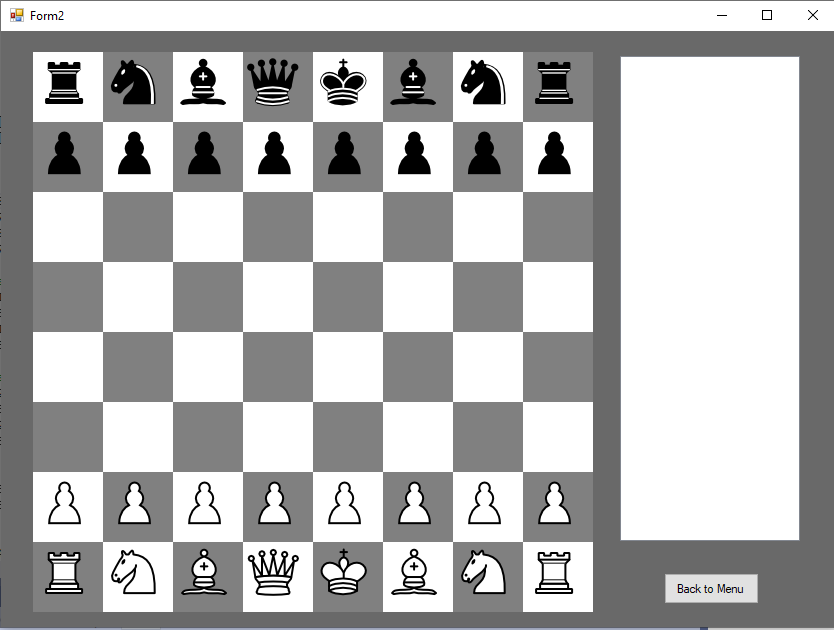
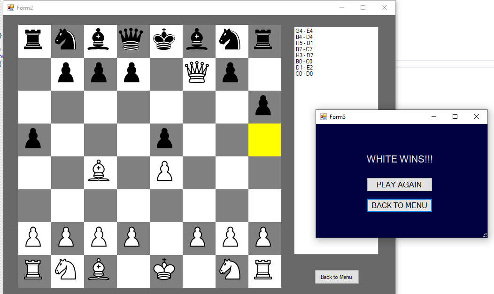

# 2-Player-Chess-Game

There are 2 different Forms in this project. First Form is used as menu. Menu has 3 options. Start is used to start game. Exit is used to close Form and exit project. Options are made with buttons. Start button create new Form2 object and make it visible.

Second Form is used to make actual game.  All pieces have its own variable and specific values. In order to differentiate white pieces from black ones, values of variables of white pieces start with 1 and values of black ones start with 2. There are also same parameters of the chess that initialized before beginning of the game. 

Actual code of the game consists of several functions. There is an Array which used to store the positions of the pieces on the board. At the beginning when Form starts, this array is filled with the initial positon of the pieces. Then create_board() function is called and all the white and black squares are placed on the Form. Squares are made with PictureBox. They have only Backcolor which is either white or black. 

After that assing_figures() function is called. It assigns picture of pieces to the PictureBoxs according to the positions of the pieces. Each PictureBox has Click event which calls get_board_number() function. PictureBoxes are created dynamically in the code. There are 64 Pictureboxes. 32 of them are white and other 32 are black. Pictureboxes are also stored in an array.

 
When one of the PictureBoxs is clicked for the first time, get_board_number() function gets position of the pieces and gives it to the variables. Then if another PictureBox is clicked get_board_number() function gets positions of this PictureBox and send all the positions and selected piece to the place_figure() function. This function checks if it is right move for selected pieces or not. Function is provided with the right moving informations of the pieces. If move is right function returns true otherwise it returns false to the get_board_number() function. If it is true picture in new position is replaced by picture in previous position. Values in array also changes according to the positions of the pieces. 

Check funtions return false if it is check situation or not. There is one check function for each sides. Check functions receive current positon of desired square. This function iterates through all the pieces of other side and check if any of them attacks current position. If it is check situation get_board_number() function sends the position of king to the Checkmate() function. 

This function tries to find if there is a way to get out of the check situation. If there is a way, it returns false otherwise returns true. If it returns true game is over. These are the main functions that make basis of the game. There are also severel helper functions. In order to check for rook, bishop and queen Check() function call check_straight() and check_dioganal() functions. Each of these functions called four times in order to check four sides. They also add positions of squares of the road between king and its attacker. 

These positions used to determine checkmate situation. Checkmate function uses this positions in order to check if there is a legal move of any piece that can break check situation. Add_road() functions append these positions to the Arraylist. In every turn pawn_to_queen() function iterate throught all the squares on the board and check if there is any pawn that reach first or last row of board and if there is any this function turn it to the queen. 

There is a ListBox on the right side of the Form. This ListBox is used to describe moves on the screen. If there is checkmate in game Form 3 appears. Winner side is described in Form3. There 2 option in this Form.  “Play Again” option is used to restart game. “Back to Menu” option is used to return first Form. Game is over if this Form appears. 

